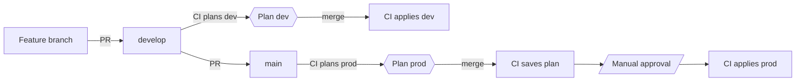

# Contributing

This repo contains the Terraform infrastructure for the agentic-kie project, deployed to AWS across three environments (`local`, `dev`, `prod`). Contributing means authoring Terraform — every change is reviewed via a CI-generated plan before it lands, and prod requires a manual approval gate on top of that.

> [!IMPORTANT]
> This project requires:
> - [Terraform](https://developer.hashicorp.com/terraform/install) ~> 1.15.0
> - [AWS CLI v2](https://docs.aws.amazon.com/cli/latest/userguide/install-cliv2.html) configured with credentials
> - [GitHub OIDC provider](https://docs.github.com/en/actions/how-tos/secure-your-work/security-harden-deployments/oidc-in-aws) configured in your AWS account

> [!NOTE]
> Check if your AWS account already has a GitHub OIDC provider configured: `aws iam list-open-id-connect-providers`. If it's not there, create it once (`token.actions.githubusercontent.com`, audience `sts.amazonaws.com`). The IAM module references it but doesn't create it.

## Contents

- [DevOps strategy](#devops-strategy)
  - [Environment model](#environment-model)
  - [Branch model](#branch-model)
- [First-time setup](#first-time-setup)
  - [Bootstrap the remote state backend](#bootstrap-the-remote-state-backend)
  - [Create the IAM roles](#create-the-iam-roles)
  - [Configure GitHub](#configure-github)
  - [Configure your local AWS profile](#configure-your-local-aws-profile)
- [Day-to-day workflow](#day-to-day-workflow)
  - [Local iteration](#local-iteration)
  - [Opening a PR](#opening-a-pr)
  - [Promoting to prod](#promoting-to-prod)
  - [Adding new infrastructure](#adding-new-infrastructure)
- [Reference](#reference)
  - [Make targets](#make-targets)
  - [Files that are gitignored](#files-that-are-gitignored)
  - [Design notes](#design-notes)

## DevOps strategy

### Environment model

The project has three deployment environments, all in the same AWS account:

| Environment | Who deploys | When |
|---|---|---|
| `local` | You, from your laptop | Iterating on infrastructure changes |
| `dev` | GitHub Actions | On merge to `develop` |
| `prod` | GitHub Actions | On merge to `main`, gated by manual approval |

> [!NOTE]
> Each environment has its own Terraform state file, its own IAM role, and its own set of resources tagged with `Environment=<env>`. The IAM roles are scoped so each one can only touch resources tagged for its own environment.

### Branch model

Two long-lived branches map to the two CI-managed environments: `develop` drives `dev`, `main` drives `prod`. Every change flows through a PR with a plan attached, and prod additionally waits on a manual approval before the saved plan is applied.



## First-time setup

You only do it once per AWS account.

### Bootstrap the remote state backend

Creates the S3 bucket that holds Terraform state for all three environments, the four `*.backend.tfbackend` config files (one per env, plus one for the IAM bootstrap), and `infra/iam/iam.tfvars` (gitignored) pre-populated with your caller ARN and bucket name:

```bash
make bootstrap
```

The bucket is private, versioned, encrypted, and uses S3 native locking (`use_lockfile = true`). No DynamoDB table required. The bootstrap script is idempotent.

### Create the IAM roles

The three deploy roles (`local`, `dev`, `prod`) live in a separate Terraform root at `infra/iam/`. They're applied once with admin credentials and rarely touched afterward.

```bash
make iam-init && make iam-apply
```

The output gives you three role ARNs. Keep them — you'll paste two into GitHub and one into your AWS config.

### Configure GitHub

In the repo settings:

**Settings → Environments → New environment → `prod`**
- Add yourself as a required reviewer.
- This is what gates the prod apply step.

**Settings → Secrets and variables → Actions → Variables (Repository tab)**
- `AWS_ROLE_ARN_DEV` = `<dev_role_arn>` from the Terraform output
- `AWS_ROLE_ARN_PROD` = `<prod_role_arn>` from the Terraform output

Variables (not secrets) is correct since role ARNs aren't sensitive on their own.

### Configure your local AWS profile

Add to `~/.aws/config`:

```ini
[profile agentic-kie-local]
role_arn       = <local_role_arn>
source_profile = default
region         = us-east-1
```

`source_profile = default` assumes you're already authenticated as your IAM user via `~/.aws/credentials` or SSO. The `agentic-kie-local` profile assumes the local-deploy role on top of that.

Verify:

```bash
AWS_PROFILE=agentic-kie-local aws sts get-caller-identity
```

The returned ARN should end in `assumed-role/agentic-kie-local-deploy/...`.

## Day-to-day workflow

### Local iteration

`make bootstrap` generates a `.envrc` file at the repo root with `export AWS_PROFILE=agentic-kie-local`. If you have [direnv](https://direnv.net/) installed, run `direnv allow` once and the profile is set automatically whenever you enter the directory:

```bash
direnv allow
```

Without direnv, export it manually for the session:

```bash
export AWS_PROFILE=agentic-kie-local
```

Then:

```bash
make init      # Initialize the local backend
make plan      # Preview changes
make apply     # Apply changes
make destroy   # Tear down all local resources
```

> [!IMPORTANT]
> `make` defaults to `ENV=local`. The Makefile refuses to apply or destroy `prod` unless `I_KNOW=1` — only CI is allowed to set that.

### Opening a PR

Branch from `develop`, push, open a PR targeting `develop`:

```bash
git switch develop
git pull
git switch -c feature/my-change
# ... edit ...
git push -u origin feature/my-change
```

CI runs the dev workflow. Within a minute the PR gets a sticky comment titled **"Terraform Plan · `dev`"** showing what would be applied. Review the plan as part of code review.

Merge the PR. CI applies the changes to dev automatically.

### Promoting to prod

Open a PR from `develop` to `main`. CI posts a sticky **"Terraform Plan · `prod`"** comment. Review and merge.

After the merge:

1. CI runs the `plan` job, generates a saved plan, uploads it as a workflow artifact.
2. CI queues the `apply` job, which waits at the prod environment approval gate.
3. You get notified. 
   - Open the workflow run.
   - Review the plan in the previous job's logs.
   - Click "Review deployments" → Approve.
4. CI applies the saved plan. The exact same bytes that were generated in step 1.

If the plan looks wrong at the approval gate, reject it. Nothing is applied.

### Adding new infrastructure

Most changes are app-level — new modules in `infra/modules/`, wired into `infra/main.tf`. The IAM roles already have `PowerUserAccess`, so they cover almost any AWS service you'd add. The deploy flow is unchanged.

You only need to touch `infra/iam/` when:

- Adding a new IAM-related resource pattern that needs explicit allow (rare).
- Tightening the permissions policy from `PowerUserAccess` to a service-specific allowlist.
- Adding a new environment.

## Reference

### Make targets

| Target | Description |
|---|---|
| `make bootstrap` | Create state bucket and write backend files (one-time, run once) |
| `make backend` | Regenerate backend files only, no AWS calls (used by CI and after fresh clone) |
| `make iam-init` | Initialize Terraform backend for the IAM bootstrap module |
| `make iam-plan` | Preview changes to the IAM bootstrap module |
| `make iam-apply` | Apply the IAM bootstrap module (creates deploy roles) |
| `make init` | Initialize Terraform backend for `ENV` |
| `make plan` | Preview infrastructure changes for `ENV` |
| `make ci-plan` | Preview changes and save plan to `tfplan.<env>` (used by CI) |
| `make apply` | Apply infrastructure changes for `ENV` (refuses prod unless `I_KNOW=1`) |
| `make ci-apply` | Apply saved plan `tfplan.<env>` (used by CI for prod) |
| `make destroy` | Destroy all infrastructure for `ENV` (refuses prod unless `I_KNOW=1`) |
| `make format` | Format all Terraform files |

`ENV` defaults to `local`. Override with `make plan ENV=dev`, etc.

### Files that are gitignored

- `.terraform/` — Terraform plugin cache and local state
- `infra/tfplan.*` — Saved plan binaries
- `infra/iam/iam.tfvars` — Contains your principal ARN
- `.envrc` — Generated by `make bootstrap`; sets `AWS_PROFILE=agentic-kie-local` for direnv

### Design notes

- **State bucket and IAM roles** are the only resources provisioned with admin credentials. All subsequent operations use the scoped deploy roles.
- **Backend files** (`infra/envs/*.backend.tfbackend`, `infra/iam/backend.tfbackend`) are committed to the repo and generated deterministically by `bootstrap-backend.sh` from the project name. CI regenerates them on every job; locally they are generated once.
- **`make plan` / `make apply`** behave identically locally and in CI. The only differences are the `AWS_PROFILE` value and the `I_KNOW=1` flag required for prod.
- **Every new resource must be tagged `Environment=<env>`**. Each deploy role has an explicit IAM deny on resources not tagged for its own environment. A missing tag won't surface during `plan`; it silently blocks the `apply`.
- **Prod protection is enforced at the IAM trust layer, not just CI**. The prod role's OIDC trust condition requires `environment:prod` GitHub environment context. Bypassing the approval gate in the workflow still results in a failed `AssumeRoleWithWebIdentity` call.
