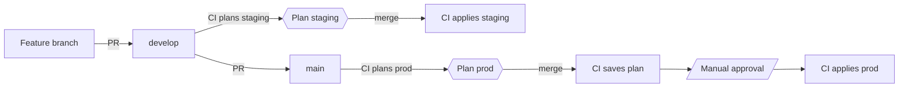

# Contributing

This repo contains the Terraform infrastructure for the Agentic KIE project, deployed to AWS across three environments (`local`, `staging`, `prod`). Contributing means authoring Terraform. Infrastructure changes trigger a CI-generated plan on every PR so reviewers can see exactly what would land; production additionally gates the apply on a manual approval against a saved plan generated post-merge.

> [!IMPORTANT]
> This project requires:
> - [Terraform](https://developer.hashicorp.com/terraform/install) ~> 1.15.0
> - [AWS CLI v2](https://docs.aws.amazon.com/cli/latest/userguide/install-cliv2.html) configured with credentials
> - [GitHub OIDC provider](https://docs.github.com/en/actions/how-tos/secure-your-work/security-harden-deployments/oidc-in-aws) configured in your AWS account
> - [uv](https://docs.astral.sh/uv/) for Python tooling and pre-commit hooks

> [!NOTE]
> Check if your AWS account already has a GitHub OIDC provider configured: `aws iam list-open-id-connect-providers`. If it's not there, create it once (`token.actions.githubusercontent.com`, audience `sts.amazonaws.com`). The IAM module references it but doesn't create it.

## Contents

- [DevOps strategy](#devops-strategy)
  - [Environment model](#environment-model)
  - [Branch model](#branch-model)
- [First-time setup](#first-time-setup)
  - [Install development dependencies and hooks](#install-development-dependencies-and-hooks)
  - [Bootstrap the remote state backend](#bootstrap-the-remote-state-backend)
  - [Create the IAM roles](#create-the-iam-roles)
  - [Create the ECR repository](#create-the-ecr-repository)
  - [Create the extractor secrets](#create-the-extractor-secrets)
  - [Configure GitHub](#configure-github)
  - [Configure your local AWS profile](#configure-your-local-aws-profile)
- [Day-to-day workflow](#day-to-day-workflow)
  - [Local iteration](#local-iteration)
  - [Manual smoke test](#manual-smoke-test)
  - [Quality gates](#quality-gates)
  - [Opening a PR](#opening-a-pr)
  - [Promoting to prod](#promoting-to-prod)
  - [Adding new infrastructure](#adding-new-infrastructure)
- [Reference](#reference)
  - [Make targets](#make-targets)
  - [Files that are gitignored](#files-that-are-gitignored)
  - [Design notes](#design-notes)

## DevOps strategy

### Environment model

The project has three deployment environments, all in the same AWS account:

| Environment | Who deploys | When |
|---|---|---|
| `local` | You, from your laptop | Iterating on infrastructure changes |
| `staging` | GitHub Actions | On merge to `develop` |
| `prod` | GitHub Actions | On merge to `main`, gated by manual approval |

> [!NOTE]
> Each environment has its own Terraform state file, its own IAM role, and its own set of resources tagged with `Environment=<env>`. The IAM roles are scoped so each one can only touch resources tagged for its own environment.

### Branch model

Two long-lived branches map to the two CI-managed environments: `develop` drives `staging`, `main` drives `prod`. Every change flows through a PR with a plan attached, and prod additionally waits on a manual approval before the saved plan is applied.


```mermaid
flowchart LR
    feature[Feature branch] -->|PR| develop[develop]
    develop -->|CI plans staging| planStaging{{Plan staging}}
    planStaging -->|merge| applyStaging[CI applies staging]

    develop -->|PR| main[main]
    main -->|CI plans prod| planProd{{Plan prod}}
    planProd -->|merge| savedPlan[CI saves plan]
    savedPlan --> approval[/Manual approval/]
    approval --> applyProd[CI applies prod]
```

> [!NOTE]
> The staging and prod apply jobs are not symmetric. Staging runs `terraform apply` directly against current state at merge time—the PR plan is informational, not the artifact applied. This is intentional: staging is the iteration environment, and the simplification is a reasonable trade-off. Prod is plan-bound: a new plan is generated post-merge, saved as an artifact, and that exact artifact is what gets applied after approval.

## First-time setup

### Install development dependencies and hooks

Sync Python dependencies, install pre-commit hooks for both `pre-commit` and `pre-push` stages, and install the tflint plugins declared in `.tflint.hcl`:

```bash
make install
```

This is idempotent. Re-run it after `git pull` whenever `pyproject.toml`, `.pre-commit-config.yaml`, or `.tflint.hcl` change.

Hooks fire automatically on every git operation:

| Stage | What runs | When |
|---|---|---|
| `pre-commit` | hygiene checks (whitespace, YAML, merge conflicts, large files, private keys), `terraform fmt`, `tflint`, `gitleaks`, `actionlint`, `shellcheck`, `pyproject-fmt`, `ruff check`, `ruff format` | On `git commit` |
| `pre-push` | `terraform validate`, `terraform trivy`, `mypy`, `pytest` | On `git push` |

The split keeps commits fast (sub-second feedback for the common loop) and reserves the slower scanners and validators for push time, before changes are shared.

> [!IMPORTANT]
> If not already installed in your system, install the following tools first—each links to installation instructions:
> - [trivy](https://github.com/aquasecurity/trivy)
> - [tflint](https://github.com/terraform-linters/tflint#installation)
> - [gitleaks](https://github.com/gitleaks/gitleaks#installing)
> - [actionlint](https://github.com/rhysd/actionlint#installation)

### Bootstrap the remote state backend

You only do it once per AWS account.

Creates the S3 bucket that holds Terraform state for all three environments, the four `*.backend.tfbackend` config files (one per env, plus one for the IAM bootstrap), and `infra/iam/iam.tfvars` (gitignored) pre-populated with your caller ARN and bucket name:

```bash
make bootstrap
```

The bucket is private, versioned, encrypted, and uses S3 native locking (`use_lockfile = true`). No DynamoDB table required. The bootstrap script is idempotent.

### Create the IAM roles

The three deploy roles (`local`, `staging`, `prod`) live in a separate Terraform root at `infra/iam/`. They're applied once with admin credentials and rarely touched afterward.

```bash
make iam-init && make iam-apply
```

The output gives you three role ARNs. Keep them—you'll paste two into GitHub and one into your AWS config.

### Create the ECR repository

The extractor Lambda is a container image, so the ECR repository must exist before the service stack can be applied. The registry lives in its own Terraform root at [infra/registry/](infra/registry/), one state file per environment, applied once per env and rebuilt approximately never afterwards. See [ADR-0008](docs/adr/0008-ecr-registry-stack-and-digest-pinned-images.md) for the rationale.

```bash
make registry-init ENV=local && make registry-apply ENV=local
make registry-init ENV=staging && make registry-apply ENV=staging
make registry-init ENV=prod  && make registry-apply ENV=prod
```

The repository is named `agentic-kie-deploy-<env>-extractor`, has tag immutability on, scan-on-push enabled, and a lifecycle policy that keeps the last ten tagged images and expires untagged images after a day. Each env writes to its own state file (`service/<env>/registry.tfstate`).

> [!TIP]
> For local-only setup, `make provision` chains `iam-init`/`iam-apply`, `registry-init`/`registry-apply`, and the service-stack `init` in one shot. The `staging` and `prod` registries still need their own `registry-init`/`registry-apply` runs, since `provision` only covers `ENV=local`.

> [!NOTE]
> The service stack consumes the repository via a `data "aws_ecr_repository"` lookup in the extractor module. If `make plan` later fails with `couldn't find resource`, the registry stack has not been applied for that env.

### Create the extractor secrets

The extractor Lambda depends on two long-lived API keys: the LLM provider key (used on the hot path) and the LangSmith key (used to ship traces). They are stored in AWS Secrets Manager, one secret per environment, created out-of-band so their lifecycle stays independent of `terraform apply` / `terraform destroy`. See [ADR-0009](docs/adr/0009-extractor-lambda.md) for the rationale.

Create the four secrets (two per env, three envs):

```bash
# LLM provider keys
aws secretsmanager create-secret \
  --name agentic-kie-deploy/local/llm-provider \
  --secret-string '<your-llm-provider-key>'
aws secretsmanager create-secret \
  --name agentic-kie-deploy/staging/llm-provider \
  --secret-string '<your-llm-provider-key>'
aws secretsmanager create-secret \
  --name agentic-kie-deploy/prod/llm-provider \
  --secret-string '<your-llm-provider-key>'

# LangSmith keys
aws secretsmanager create-secret \
  --name agentic-kie-deploy/local/langsmith \
  --secret-string '<your-langsmith-key>'
aws secretsmanager create-secret \
  --name agentic-kie-deploy/staging/langsmith \
  --secret-string '<your-langsmith-key>'
aws secretsmanager create-secret \
  --name agentic-kie-deploy/prod/langsmith \
  --secret-string '<your-langsmith-key>'
```

Terraform discovers the secrets by name at plan time—no ARNs to copy or paste.

> [!IMPORTANT]
> Terraform manages the IAM grants on these secrets but **not** their values. Rotating a key is `aws secretsmanager update-secret` against the existing secret; the Lambda picks the new value up on the next cold start (warm invocations within a ~15-minute execution-environment lifetime continue to see the old value, by design).

> [!NOTE]
> The uploader module has no out-of-band setup. It is part of the service stack and picks up `url_ttl_seconds` and `allowed_upload_origins` from tfvars at apply time.

### Configure GitHub

In the repo settings:

**Settings → Environments → New environment → `prod`**
- Add yourself as a required reviewer.
- This is what gates the prod apply step.

**Settings → Secrets and variables → Actions → Variables (Repository tab)**
- `AWS_ROLE_ARN_STAGING` = `<staging_role_arn>` from the Terraform output
- `AWS_ROLE_ARN_PROD_PLAN` = `<prod_plan_role_arn>` from the Terraform output (used by plan jobs on PRs and post-merge, plus the pre-apply build-and-push job; read-only except for scoped ECR push to the extractor repository)
- `AWS_ROLE_ARN_PROD` = `<prod_role_arn>` from the Terraform output (write; used by the apply job only)

Variables (not secrets) is correct since role ARNs aren't sensitive on their own.

### Configure your local AWS profile

Add to `~/.aws/config`:

```ini
[profile agentic-kie-local]
role_arn       = <local_role_arn>
source_profile = default
region         = us-east-1
```

`source_profile = default` assumes you're already authenticated as your IAM user via `~/.aws/credentials` or SSO. The `agentic-kie-local` profile assumes the local-deploy role on top of that.

Verify:

```bash
AWS_PROFILE=agentic-kie-local aws sts get-caller-identity
```

The returned ARN should end in `assumed-role/agentic-kie-local-deploy/...`.

## Day-to-day workflow

### Local iteration

The repo includes a `.envrc` that sets `AWS_PROFILE=agentic-kie-local` automatically via [direnv](https://direnv.net). Run `direnv allow` once after cloning and the profile is set whenever you enter the directory. Without direnv, export it manually:

```bash
export AWS_PROFILE=agentic-kie-local
```

```bash
make init                # Initialize the local backend (idempotent, safe to re-run)
make plan                # Preview changes
make apply               # Apply changes
make destroy ENV=local   # Tear down all local resources
```

> [!NOTE]
> The service stack requires `extractor_image_digest` (digest-pinned per ADR-0008/0009). For local applies, use `make build-extractor` to build, push, and capture the digest in one step:
>
> ```bash
> export TF_VAR_extractor_image_digest=$(make build-extractor ENV=local)
> make apply ENV=local
> ```
>
> `make build-extractor` accepts any `ENV`, but outside `local` that use case is owned by CI. Only reach for it manually for other environments when troubleshooting.

> [!IMPORTANT]
> `make` defaults to `ENV=local`. The Makefile refuses to apply or destroy `prod` unless `I_KNOW=1`—only CI is allowed to set that. `make destroy` only tears down the service stack; the ECR repository in `infra/registry/` has its own lifecycle and a separate `make registry-destroy ENV=<env>` command (same guards apply—prefer it over invoking `terraform destroy` directly inside `infra/registry/`).

### Manual smoke test

After applying infrastructure, you can verify the pipeline end-to-end using only the AWS CLI. Two paths matter: the direct-S3 path exercises the extraction half (S3 → EventBridge → SQS → Lambda → DynamoDB), and the uploader-API path additionally exercises the front door (API Gateway → presigner → presigned PUT).

**Direct-S3 path** (bypasses the uploader, useful for isolating the extraction half):

```bash
# 1. Capture terraform outputs
BUCKET=$(terraform -chdir=infra output -raw ingestion_bucket_name)
TABLE=$(terraform -chdir=infra output -raw results_table_name)
FUNCTION=$(terraform -chdir=infra output -raw extractor_function_name)

# 2. Upload a PDF
DOC_ID=$(uuidgen | tr '[:upper:]' '[:lower:]')
aws s3 cp tests/static/smoke_document.pdf \
  "s3://$BUCKET/uploads/$(date +%Y/%m/%d)/$DOC_ID"

# 3. Watch Lambda logs in real time
aws logs tail "/aws/lambda/$FUNCTION" --follow

# 4. Check DynamoDB for the result
aws dynamodb get-item \
  --table-name "$TABLE" \
  --key "{\"document_id\":{\"S\":\"$DOC_ID\"}}" \
  --consistent-read
```

**Uploader-API path** (exercises the full surface, including SigV4 and the presigner):

```bash
# 1. Capture the uploader endpoint and downstream outputs
API=$(terraform -chdir=infra output -raw uploader_api_endpoint)
TABLE=$(terraform -chdir=infra output -raw results_table_name)

# 2. Sign POST /uploads with SigV4 and capture the presigned PUT URL
RESP=$(awscurl --service execute-api -X POST "$API/uploads")
DOC_ID=$(echo "$RESP" | jq -r .document_id)
UPLOAD_URL=$(echo "$RESP" | jq -r .upload_url)

# 3. PUT the document to the returned URL (no signing—the URL is already signed)
curl -X PUT --data-binary @tests/static/smoke_document.pdf "$UPLOAD_URL"

# 4. Check DynamoDB for the result
aws dynamodb get-item \
  --table-name "$TABLE" \
  --key "{\"document_id\":{\"S\":\"$DOC_ID\"}}" \
  --consistent-read
```

> [!NOTE]
> `make smoke` runs both paths automatically via pytest (`TestExtractorSmoke` and `TestUploaderSmoke` in [tests/test_smoke.py](tests/test_smoke.py), each with a 180-second timeout). Use the manual steps above when you want to observe log output in real time or inspect the raw DynamoDB item.

### Quality gates

Hooks run automatically, but you can also invoke them on demand. Useful when you want fast feedback on a single tool, or to run the full suite before pushing.

```bash
make check     # Run every hook against every file (both stages)
make format    # Apply ruff lint fixes and formatting to src
make lint      # Run ruff check on src
make type      # Run mypy on src
make test      # Run pytest with coverage
make tf-format # Format all Terraform files
```

`make check` is what the CI mirror job runs. If it passes locally, your PR will pass the lint/format/scan stage in CI.

If a hook version in `.pre-commit-config.yaml` is updated, `make install` reinstalls the hook environments. If the tflint plugin version in `.tflint.hcl` changes, run `make tflint-init` (or `make install`) to refresh the plugin cache.

### Opening a PR

Branch from `develop`, push, open a PR targeting `develop`:

```bash
git switch develop
git pull
git switch -c feature/my-change
# ... edit ...
git push -u origin feature/my-change
```

CI runs the staging workflow. Within a minute the PR gets a sticky comment titled **"Terraform Plan · `staging`"** showing what would be applied. Review the plan as part of code review.

Merge the PR. The staging workflow triggers on changes under `infra/**`, `src/extractor/**`, or `src/uploader/**`. On merge, if anything under `src/extractor/**` changed, CI runs `build-and-push` first—it builds the container image, pushes it to the staging ECR repository, and publishes the resulting digest as a job output that the apply job consumes. Changes under `src/uploader/**` or service-only Terraform tweaks skip the Docker work; the uploader is a zip Lambda repackaged by Terraform on every apply, and infra-only changes re-apply with the previously-deployed digest. Either way, CI applies the changes to staging automatically, then runs `make smoke` as a post-apply check; a smoke failure fails the workflow. Smoke exercises both entry points—`TestExtractorSmoke` uploads directly to S3, `TestUploaderSmoke` goes through the uploader API and a presigned PUT—and both poll for a `succeeded` status in the results table.

### Promoting to prod

Open a PR from `develop` to `main`. CI posts a sticky **"Terraform Plan · `prod`"** comment. Review and merge.

After the merge:

1. The prod workflow triggers on changes under `infra/**`, `src/extractor/**`, or `src/uploader/**`. If anything under `src/extractor/**` changed, CI runs `build-and-push` (under the prod-plan role's scoped ECR push permission) to publish a new image and emit its digest. Uploader-only and infra-only changes skip this step.
2. CI runs the `plan` job, generates a saved plan, uploads it as a workflow artifact.
3. CI queues the `apply` job, which waits at the prod environment approval gate.
4. You get notified.
   - Open the workflow run.
   - Review the plan in the previous job's logs.
   - Click "Review deployments" → Approve.
5. CI applies the saved plan. The exact same bytes that were generated in step 2.

If the plan looks wrong at the approval gate, reject it. Nothing is applied.

### Adding new infrastructure

Most changes are app-level—new modules in `infra/modules/`, wired into `infra/main.tf`. The IAM roles already have `PowerUserAccess`, so they cover almost any AWS service you'd add. The deploy flow is unchanged.

After adding a new Terraform module or bumping a provider version, regenerate the lock files so CI (linux/amd64) has the right platform hashes:

```bash
make lock
```

Then commit the updated `.terraform.lock.hcl` files alongside your change. If you skip this, the `terraform_validate` pre-commit hook will fail in CI with "files were modified by this hook".

You only need to touch `infra/iam/` when:

- Adding a new IAM-related resource pattern that needs explicit allow (rare).
- Tightening the permissions policy from `PowerUserAccess` to a service-specific allowlist.
- Adding a new environment.

## Reference

### Make targets

Run `make help` for the full list of targets with descriptions, grouped by section. `ENV` defaults to `local`; override with `make plan ENV=staging`, etc.

### Files that are gitignored

- `.terraform/`—Terraform plugin cache and local state
- `infra/tfplan.*`—Saved plan binaries
- `infra/iam/iam.tfvars`—Contains your principal ARN

### Design notes

- **State bucket and IAM roles** are the only resources provisioned with admin credentials. All subsequent operations use the scoped deploy roles.
- **Backend files** (`infra/envs/*.backend.tfbackend`, `infra/iam/backend.tfbackend`) are committed to the repo and generated deterministically by `bootstrap-backend.sh` from the project name. CI regenerates them on every job; locally they are generated once.
- **`make plan` / `make apply`** behave identically locally and in CI. The only differences are the `AWS_PROFILE` value and the `I_KNOW=1` flag required for prod.
- **Every new resource must be tagged `Environment=<env>`**. Each deploy role has an explicit IAM deny on resources not tagged for its own environment. A missing tag won't surface during `plan`; it silently blocks the `apply`.
- **Prod protection is enforced at the IAM trust layer, not just CI**. The prod role's OIDC trust condition requires `environment:prod` GitHub environment context. Bypassing the approval gate in the workflow still results in a failed `AssumeRoleWithWebIdentity` call.
