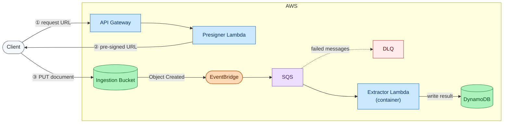

<h1 align="center">Agentic KIE Deploy</h1>
<p align="center">
  <strong>Serverless, event-driven AWS infrastructure for asynchronous document key-information extraction.</strong>
</p>
<p align="center">
<a href="LICENSE"></a>
</p>

---

<p align="center">A client uploads a document to S3 and receives structured fields back — names, dates, amounts, line items — without waiting on the LLM call or managing extraction infrastructure. The entire pipeline is serverless, event-driven, and provisioned with Terraform on AWS.</p>

## Contents

- [Architecture](#architecture)
- [Modules](#modules)
  - [Storage](#storage)
- [Infrastructure](#infrastructure)
- [Getting started](#getting-started)
- [Contributing](#contributing)

---

## Architecture

The pipeline is fully asynchronous. A client calls a small presigner Lambda behind an API Gateway HTTP endpoint, which returns a short-lived pre-signed S3 PUT URL. The client uploads the document directly to S3, bypassing API Gateway payload limits entirely. The bucket emits an `Object Created` event to EventBridge, which routes it to an SQS queue with a dead-letter queue and redrive policy for resilience. SQS then triggers the extractor Lambda, packaged as a container image from ECR to accommodate heavier ML and LLM dependencies. The extractor runs an agentic LLM loop against the document and writes the resulting structured record to a DynamoDB table keyed by document ID.

| Component | Service | Role |
|---|---|---|
| Presigner | Lambda + API Gateway | Issues short-lived pre-signed PUT URLs to clients |
| Ingestion bucket | S3 | Receives uploads directly from clients, emits Object Created events |
| Event router | EventBridge | Routes bucket events to the extraction queue |
| Queue | SQS + DLQ | Buffers events, retries on failure, isolates bad messages |
| Extractor | Lambda (container image) | Runs the agentic LLM extraction loop |
| Store | DynamoDB | Holds structured results, keyed by document ID |

Every component scales to zero when idle. Ingress is synchronous and cheap (pre-signed URL handoff). Extraction is fully decoupled and retryable.



---

## Modules

The infrastructure is organized as small, per-concern Terraform modules wired together at the root in [infra/main.tf](infra/main.tf).

| Module | Path | Status |
|---|---|---|
| `storage` | [infra/modules/storage/](infra/modules/storage/) | Implemented |
| `queue` | [infra/modules/queue/](infra/modules/queue/) | Planned |
| `table` | [infra/modules/table/](infra/modules/table/) | Planned |
| `registry` | [infra/modules/registry/](infra/modules/registry/) | Planned |
| `extractor` | [infra/modules/extractor/](infra/modules/extractor/) | Planned |
| `uploader` | [infra/modules/uploader/](infra/modules/uploader/) | Planned |

### Storage

The ingestion bucket is the entry point of the pipeline. Clients upload documents directly via pre-signed PUT URLs, and the bucket forwards `Object Created` events to EventBridge for downstream routing. The bucket is locked down through four orthogonal hardening layers:

| Layer | Mechanism | What it closes |
|---|---|---|
| Public Access Block | All four block flags enabled | Prevents ACLs or policies from ever making objects public |
| Ownership controls | `BucketOwnerEnforced` | Disables ACLs entirely; every object is owned by the bucket account regardless of uploader |
| TLS-only policy | Deny on `aws:SecureTransport = false` | Enforces HTTPS at the policy layer; old SDKs and misconfigured clients cannot fall back to HTTP |
| Default encryption | SSE-S3 (AES256) | Protects data at rest; AWS manages the key transparently |

EventBridge notifications are enabled on the bucket so object-creation events flow into the rest of the system. The routing rule lives with the queue module.

CORS is configured to allow `PUT` requests from the origins listed in `allowed_upload_origins`, which is the only method clients need to deposit documents.

> [!NOTE]
> The bucket currently uses SSE-S3 (AES256), which is appropriate for a portfolio project. For a production workload ingesting PII or regulated documents, the right posture is SSE-KMS with a customer-managed key and S3 Bucket Keys enabled. A CMK adds a second, independent permission gate (`kms:Decrypt` in addition to `s3:GetObject`), full CloudTrail auditability on every decrypt, and a kill switch. The cheapest moment to switch is before any real documents arrive.

---

## Infrastructure

Terraform state is stored remotely in an S3 bucket created by [bootstrap.sh](bootstrap.sh). The bucket is private, versioned, encrypted at rest, and uses S3 native locking (`use_lockfile = true`), so no DynamoDB table is required.

The [Makefile](Makefile) wraps all common Terraform commands:

```bash
make bootstrap   # Create state bucket, write infra/backend.tfbackend (once per environment)
make init        # terraform init with the generated backend config
make plan        # Preview infrastructure changes
make apply       # Apply infrastructure changes
make format      # Format all Terraform files
make destroy     # Destroy all infrastructure
```

> [!IMPORTANT]
> `infra/backend.tfbackend` is gitignored and must never be committed. Run `make bootstrap` to regenerate it after a fresh clone.

---

## Getting started

> [!IMPORTANT]
> Requires [Terraform](https://developer.hashicorp.com/terraform/install) >= 1.13 and the [AWS CLI](https://docs.aws.amazon.com/cli/latest/userguide/install-cliv2.html) configured with credentials.

1. Bootstrap the remote state backend (once per environment):

```bash
make bootstrap
```

2. Initialize Terraform with the generated backend config:

```bash
make init
```

3. Preview and apply:

```bash
make plan
make apply
```

---

## Contributing

See [CONTRIBUTING.md](CONTRIBUTING.md) for prerequisites, setup instructions, and available `make` targets.
