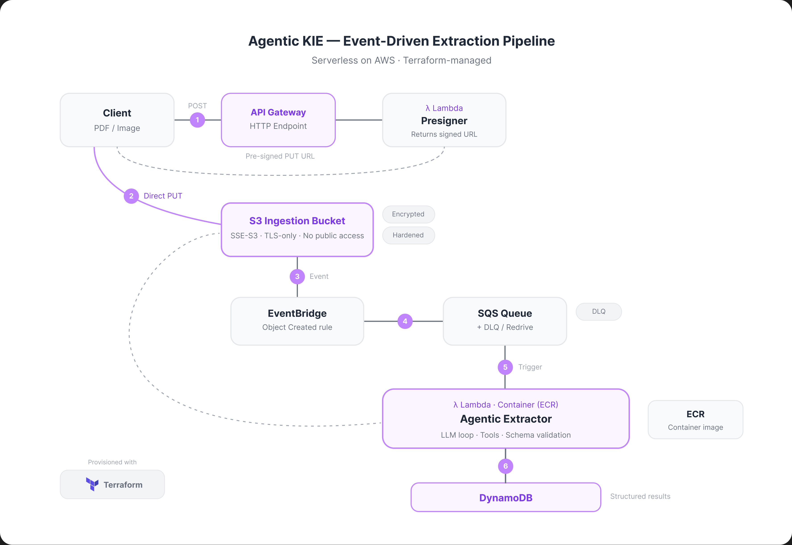

<h1 align="center">Agentic KIE Deployment</h1>

  <strong>Serverless, event-driven AWS infrastructure for asynchronous document key-information extraction.</strong>

---

A client uploads a document to S3 and receives structured fields back — names, dates, amounts, line items — without waiting on the LLM call or managing extraction infrastructure. The entire pipeline is serverless, event-driven, and provisioned with Terraform on AWS.

## Contents

- [Architecture](#architecture)
- [Modules](#modules)
  - [Storage](#storage)
- [Contributing](#contributing)
- [Architecture decisions](docs/adr/README.md)

---

## Architecture

The pipeline is fully asynchronous. A client calls a small presigner Lambda behind an API Gateway HTTP endpoint, which returns a short-lived pre-signed S3 PUT URL. The client uploads the document directly to S3, bypassing API Gateway payload limits entirely. The bucket emits an `Object Created` event to EventBridge, which routes it to an SQS queue with a dead-letter queue and redrive policy for resilience. SQS then triggers the extractor Lambda, packaged as a container image from ECR to accommodate heavier ML and LLM dependencies. The extractor runs the [`agentic-kie`](https://github.com/gafnts/agentic-kie) library against the document and writes the resulting structured record to a DynamoDB table keyed by document ID.

| Component | Service | Role |
|---|---|---|
| Presigner | Lambda + API Gateway | Issues short-lived pre-signed PUT URLs to clients |
| Ingestion bucket | S3 | Receives uploads directly from clients, emits Object Created events |
| Event router | EventBridge | Routes bucket events to the extraction queue |
| Queue | SQS + DLQ | Buffers events, retries on failure, isolates bad messages |
| Extractor | Lambda (container image) | Runs the agentic LLM extraction loop |
| Store | DynamoDB | Holds structured results, keyed by document ID |

---

## Modules

The infrastructure is organized as small, per-concern Terraform modules wired together at the root in [infra/main.tf](infra/main.tf).

| Module | Path | Status |
|---|---|---|
| `storage` | [infra/modules/storage/](infra/modules/storage/) | Implemented |
| `queue` | [infra/modules/queue/](infra/modules/queue/) | Planned |
| `table` | [infra/modules/table/](infra/modules/table/) | Planned |
| `registry` | [infra/modules/registry/](infra/modules/registry/) | Planned |
| `extractor` | [infra/modules/extractor/](infra/modules/extractor/) | Planned |
| `uploader` | [infra/modules/uploader/](infra/modules/uploader/) | Planned |

### Storage

The ingestion bucket is the entry point of the pipeline. Clients upload documents directly via pre-signed PUT URLs, and the bucket forwards `Object Created` events to EventBridge for downstream routing. The bucket is locked down through four orthogonal hardening layers:

| Layer | Mechanism | What it closes |
|---|---|---|
| Public Access Block | All four block flags enabled | Prevents ACLs or policies from ever making objects public |
| Ownership controls | `BucketOwnerEnforced` | Disables ACLs entirely; every object is owned by the bucket account regardless of uploader |
| TLS-only policy | Deny on `aws:SecureTransport = false` | Enforces HTTPS at the policy layer; old SDKs and misconfigured clients cannot fall back to HTTP |
| Default encryption | SSE-S3 (AES256) | Protects data at rest; AWS manages the key transparently |

EventBridge notifications are enabled on the bucket so object-creation events flow into the rest of the system. The routing rule lives with the queue module.

CORS is configured to allow `PUT` requests from the origins listed in `allowed_upload_origins`, which is the only method clients need to deposit documents.

> [!NOTE]
> The bucket currently uses SSE-S3 (AES256). For workloads ingesting PII or regulated documents, SSE-KMS with a customer-managed key and S3 Bucket Keys enabled provides a second permission gate (`kms:Decrypt` in addition to `s3:GetObject`) and full CloudTrail auditability on every decrypt.

---

## Contributing

See [CONTRIBUTING.md](CONTRIBUTING.md) for prerequisites, the bootstrap and IAM setup procedure, local AWS profile configuration, available `make` targets, and the full DevOps strategy.
