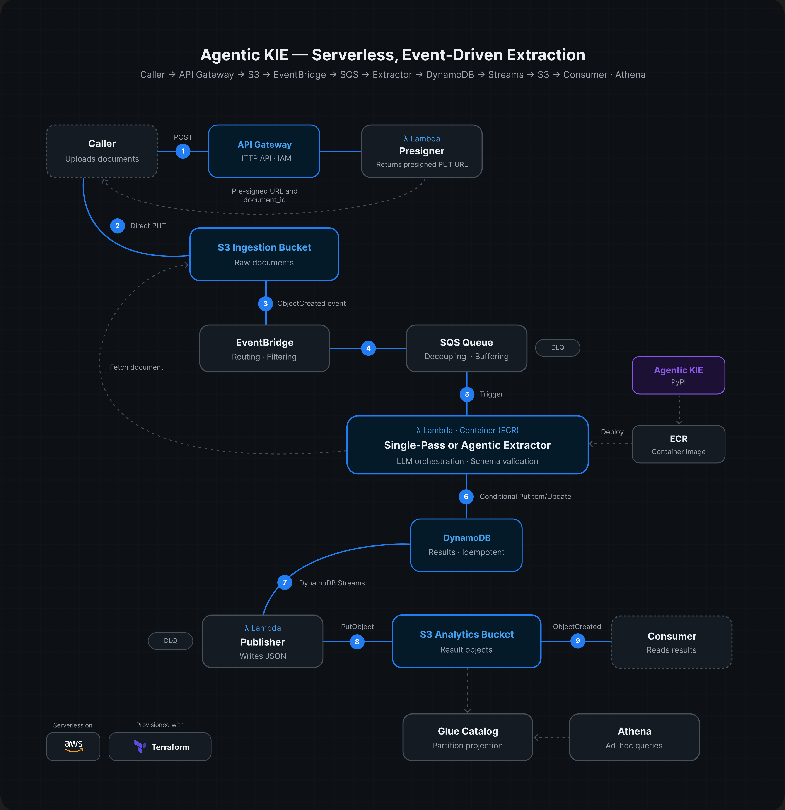

<h1 align="center">Agentic KIE Deployment</h1>
<p align="center">
  <strong>Serverless, event-driven AWS infrastructure for asynchronous key information extraction with LLMs.</strong>
</p>
<p align="center">
<a href="https://github.com/gafnts/agentic-kie-deploy/actions/workflows/checks.yml"></a>
<a href="https://github.com/gafnts/agentic-kie-deploy/actions/workflows/deploy-staging.yml"></a>
<a href="https://github.com/gafnts/agentic-kie-deploy/actions/workflows/deploy-prod.yml"></a>
<a href="LICENSE"></a>
</p>

---

<p align="center">A caller asks for an upload slot, uploads a document, and reads the structured result from a known S3 address. Everything in between is fully serverless, event-driven, and provisioned with Terraform on AWS.</p>

## Contents

- [Why this exists](#why-this-exists)
- [How it works](#how-it-works)
- [Using the pipeline](#using-the-pipeline)
- [Modules](#modules)
- [Documentation](#documentation)

---

## Why this exists

[`agentic-kie`](https://github.com/gafnts/agentic-kie) is a Python library that extracts structured fields from PDF documents with LLMs. A library is not a service. Running it against real traffic means solving four problems the library does not address: absorbing arbitrary uploads without proxying large payloads through compute, decoupling the synchronous caller from the slow LLM call, making extraction retryable without re-uploading, and fitting heavy ML dependencies into a Lambda execution environment.

This repository is that production layer: the AWS infrastructure that turns the library into an asynchronous extraction service. It is built as a deployable template, one instance per extraction use case (one document type and schema) owned by the team that deploys it, rather than a multi-tenant platform spanning schemas. Within an instance, callers and consumers can both be many; the one schema is the boundary. The reasoning is settled in [ADR-0013](docs/adr/0013-single-tenant-deployment-model.md) and refined in [ADR-0017](docs/adr/0017-refine-tenancy-unit-to-schema.md); the full set of decisions lives in the [architecture decision records](docs/adr/README.md).

---

## How it works

The pipeline is asynchronous from end to end. A caller signs `POST /uploads` against the uploader's API Gateway HTTP API (authorized via `AWS_IAM`); the presigner Lambda mints a UUIDv7 `document_id` and returns it alongside a short-lived pre-signed S3 PUT URL. The caller uploads the document directly to the ingestion bucket, bypassing API Gateway payload limits. The bucket emits an `Object Created` event to EventBridge, which routes it to an SQS queue (backed by a dead-letter queue) that triggers the extractor Lambda, packaged as a container image to carry the heavy LLM dependencies.

The extractor runs [`agentic-kie`](https://github.com/gafnts/agentic-kie) and writes the structured record to a DynamoDB table keyed by `document_id`. That terminal write fans out through DynamoDB Streams to the publisher Lambda, which lands the result payload as JSON in a separate analytics bucket at the address the caller already learned at presign time. The caller's `s3:ObjectCreated:*` subscription on that prefix fires the moment the object arrives, and the same objects back a Glue catalog table queried through a dedicated Athena workgroup.



| Component | Service | Role |
|---|---|---|
| Uploader API | API Gateway HTTP API (`AWS_IAM`) | Authorizes SigV4-signed `POST /uploads` from in-account callers |
| Presigner | Lambda (zip) | Mints `document_id` (UUIDv7) and returns a short-lived pre-signed PUT URL |
| Ingestion bucket | S3 | Receives uploads directly from callers, emits Object Created events |
| Event router | EventBridge | Routes bucket events to the extraction queue |
| Queue | SQS + DLQ | Buffers events, retries on failure, isolates bad messages |
| Extractor | Lambda (container image) | Runs the agentic LLM extraction loop |
| Results table | DynamoDB (+ Streams) | Holds the canonical extraction row, keyed by `document_id` |
| Result publisher | Lambda (zip) | Consumes Streams, writes terminal results to the analytics bucket |
| Analytics bucket | S3 | Holds result objects; the caller subscribes to its `s3:ObjectCreated:*` events |
| Catalog | Glue table + Athena workgroup | Ad-hoc query layer over the analytics partition |

---

## Using the pipeline

A caller touches the system at exactly two points: the uploader API at the front, and the analytics bucket at the back. Everything in between is internal.

1. Request an upload slot. Sign `POST /uploads` with SigV4 (the route is `AWS_IAM` authorized, so the caller signs with the IAM role it already holds).
```bash
awscurl --service execute-api -X POST "$API/uploads"
```
The response carries the document's identity and where to write it:
```json
{
  "document_id": "0190c3b2-7f4e-7a21-9c3d-1f2e3a4b5c6d",
  "upload_url": "https://<ingestion-bucket>.s3.amazonaws.com/uploads/2026/05/17/0190c3b2-7f4e-7a21-9c3d-1f2e3a4b5c6d?X-Amz-Algorithm=...",
  "expires_at": "2026-05-17T14:13:11.482913+00:00"
}
```

2. Upload the document to the pre-signed URL. The URL is already signed, so no further authentication is needed:
```bash
curl -X PUT --data-binary @document.pdf "$UPLOAD_URL"
```

3. Read the result from S3 once it lands at `extractions/{yyyy}/{mm}/{dd}/{document_id}.json`. Subscribe to the analytics bucket's `s3:ObjectCreated:*` events to be notified the moment it arrives:
```json
{
  "document_id": "0190c3b2-7f4e-7a21-9c3d-1f2e3a4b5c6d",
  "status": "succeeded",
  "created_at": "2026-05-17T14:03:11.482913+00:00",
  "completed_at": "2026-05-17T14:03:19.781204+00:00",
  "extracted_fields": {
    "effective_date": "2019-03-14",
    "jurisdiction": "Delaware",
    "party": [{ "name": "Nike_Inc." }, { "name": "Acme_LLC" }],
    "term": "2_years"
  },
  "model_version": "gemini-3-flash-preview",
  "token_usage": { "input": 8123, "output": 142 },
  "processing_ms": 8299
}
```

A result object is written only for a terminal outcome. `status` is `succeeded` or `failed` (a failed object carries an `error` block instead of `extracted_fields`). A document still in flight, or one that exhausted its retries into the dead-letter queue, has no object yet.

> [!NOTE]
> The caller needs two grants, both scoped against Terraform outputs: `execute-api:Invoke` on the uploader route (`uploader_route_arn`) and `s3:GetObject` on the analytics bucket's `extractions/*` prefix (`analytics_bucket_arn`). The grants live on the caller's side because an instance serves one schema but any number of in-account callers and consumers, each scoping its own access ([ADR-0013](docs/adr/0013-single-tenant-deployment-model.md) / [ADR-0017](docs/adr/0017-refine-tenancy-unit-to-schema.md)).

For runnable end-to-end commands covering both the direct-S3 and full uploader paths, see the manual smoke test in [CONTRIBUTING.md](CONTRIBUTING.md).

---

## Modules

The infrastructure is a set of small, per-concern Terraform modules wired together at the root in [infra/main.tf](infra/main.tf). The table below is a map; the full reference for each module (every lever, default, and the reasoning behind it) lives in [docs/README.md](docs/README.md).

| Module | Path | Role |
|---|---|---|
| `uploader` | [infra/modules/uploader/](infra/modules/uploader/) | Presigner Lambda behind the API Gateway front door |
| `bucket` | [infra/modules/bucket/](infra/modules/bucket/) | Ingestion bucket and its hardening layers |
| `queue` | [infra/modules/queue/](infra/modules/queue/) | SQS and DLQ between ingestion and the extractor |
| `table` | [infra/modules/table/](infra/modules/table/) | DynamoDB results table with Streams |
| `extractor` | [infra/modules/extractor/](infra/modules/extractor/) | Container-image Lambda running `agentic-kie` |
| `publisher` | [infra/modules/publisher/](infra/modules/publisher/) | Streams consumer that writes results to S3 |
| `analytics` | [infra/modules/analytics/](infra/modules/analytics/) | Results bucket plus the Glue and Athena query layer |
| `alarms` | [infra/modules/alarms/](infra/modules/alarms/) | SNS topic and the CloudWatch alarm fan-out |

---

## Documentation

| Where | What |
|---|---|
| [docs/README.md](docs/README.md) | Per-module reference: every lever, default, and tradeoff, plus the observability plane |
| [CONTRIBUTING.md](CONTRIBUTING.md) | How to set up, deploy, and operate the stack (environments, branches, day-to-day workflow) |
| [docs/adr/](docs/adr/README.md) | Architecture decision records: why each choice was made and what was rejected |
